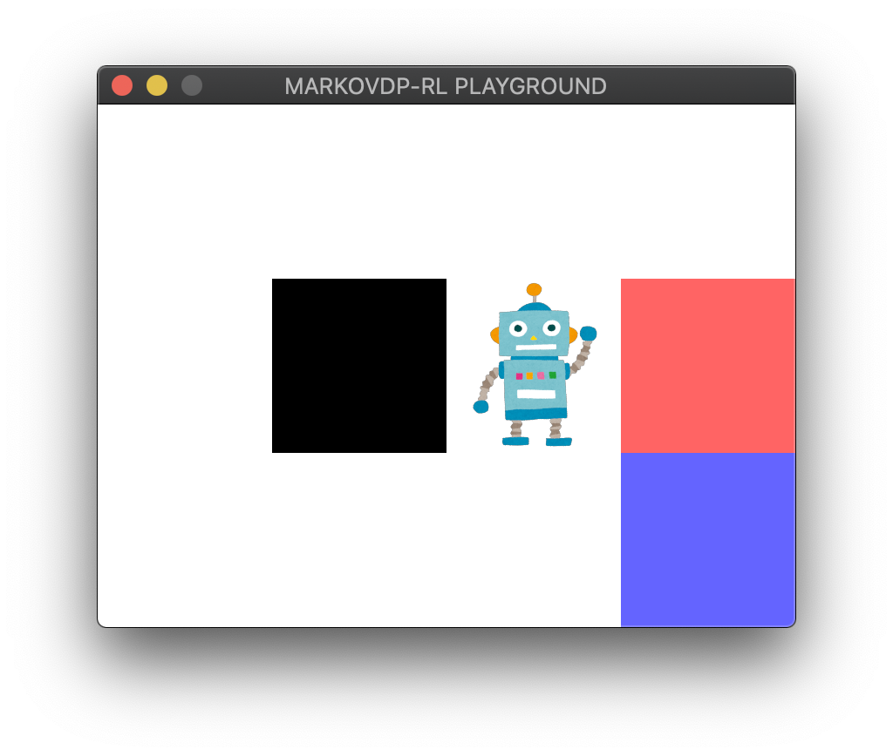

# markovdp-rl

This is the implementation of reinforcement learning algorithm for Markov Decision Process environment, greatly owed to [baby-steps-of-rl-ja](https://github.com/icoxfog417/baby-steps-of-rl-ja).



## How to Play

```zsh
git clone git@github.com:snjot/markovdp-rl.git
cd markovdp-rl
poetry install
poetry run python -m markovdp --gui --delay 0.2
```

## TODO

- [ ] implement Monte Carlo agent
